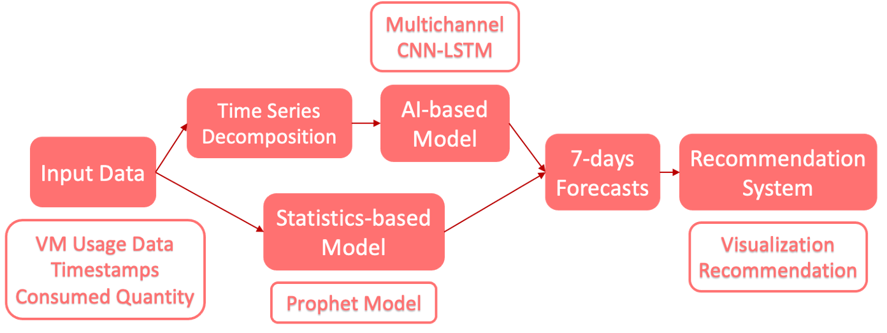

# Final project 

## :one: 建置Anaconda環境
* __Document：__ requirements.txt


1. __Mac(intel)&windows__
    * __下載 [anaconda](https://www.anaconda.com/products/individual)__
       
    * __開終端機並依序輸入下令指令：__
>          conda create --name AI_recom python ==3.6

>          pip install -r requirements.txt
    
2. __Mac(m1)__
    * __下載 [anaconda](https://www.anaconda.com/products/individual)__
       
     * __根據下列網址操作：__
            * [MacOS M1(Apple Silicon) 安装配置 Conda 環境](https://zhuanlan.zhihu.com/p/349295868)
            * [M1配置Tensorflow](https://zhuanlan.zhihu.com/p/367512283)
            
            
## :two:Data analysis&preprocessing  
* __Document：__ datapreprocessing
* __匯入資料-重新命名-切割資料取出想要的欄位-合併資料集-捨棄不需要的欄位__
* __日期的欄位轉成日期格式-排序日期__
```python=
    import datetime
    import pandas as pd
    import numpy as np


    df_us=pd.read_csv('/Users/debby/DIGI/DIGI_TCA_2021/data/VM-Usage.csv')
    pricesheet=pd.read_csv('/Users/debby/DIGI/DIGI_TCA_2021/data/azure-retail-multi-price-2021-07-01.csv')

    usage= df_us.rename(columns={'MeterId': 'meterId'})

    usage['RG'] = usage['InstanceId'].str.split('/', expand=True).pop(4)
    usage['ServiceType'] = usage['InstanceId'].str.split('/', expand=True).pop(7)

    meter_sku= pd.merge(usage, pricesheet, on='meterId', how='left')

    meter_sku.drop(['InstanceId','ResourceLocation','UnitOfMeasure',
                    'meterName','productId','productName','skuId',
                    'serviceName','serviceId','serviceFamily',
                    'armSkuName','armRegionName','effectiveStartDate',
                    'currencyCode','tierMinimumUnits','unitOfMeasure',
                    'armSkuSpec','armSkuSpecRaw','operatingSystem',
                    'retailPrice','devtestPrice','riPrice1Y','spotPrice',
                    'detailJSON','updateTime','location', 'riPrice3Y','Cost'],
                   axis=1, inplace=True)
    meter_sku['DATE']= pd.to_datetime(meter_sku['DATE'])
    df = meter_sku.sort_values(by='DATE')
```
## :three:model tunning
* __Document：__ model(tunning) + recommendation(price recommendation)
1. __Prophet__

2. __Multichannel__

## :four:Data visualization
* __Document：__ finalvisualization

1. __Raw data visualization__
    * __Drop-down list__
   
  
    

2. __Model predict visualization__


    
    
    
3. __Recommendation visualization__

    
* __開啟bokeh的方式:__ 打開termianal，並移到存有bokeh檔案的目錄並輸入以下指令：
```
bokeh serve --show p1.py
```
* __p1__=該檔案名稱

## Reference
1. [Bokeh](http://docs.bokeh.org/en/latest/)
2. [Pandas](https://yanwei-liu.medium.com/python-pandas%E4%BD%BF%E7%94%A8%E7%AD%86%E8%A8%98-a4682e254d90)


